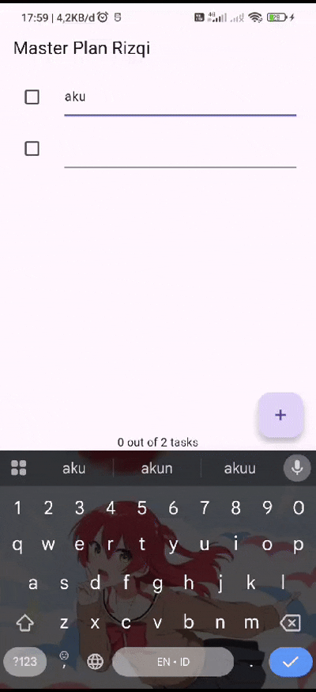
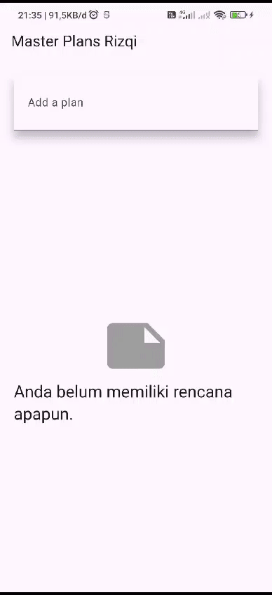

# Praktikum 1: Dasar State dengan Model-View

## Penjelasan

Di praktikum pertama belajar tentang dasar-dasar state management dengan pendekatan Model-View. Intinya, akan bikin model untuk menyimpan data task dan daftar plan, lalu menampilkannya di UI.

**Langkah-langkahnya:**

1. **Buat Project Baru** dengan nama `master_plan`.
2. **Bikin Model Task dan Plan** untuk menyimpan daftar task dan plan.
3. **Gabungin Semua Model di `data_layer.dart`** biar lebih rapi.
4. **Siapkan `main.dart`** untuk mengarah ke `PlanScreen`.
5. **Bikin `PlanScreen`** sebagai layar utama.
6. **Tambah Tombol Add Task**, biar bisa nambah task baru.
7. **Bikin ListView untuk Menampilkan task**.
8. **Tambahkan Checkbox dan TextField** buat edit dan checklist task.
9. **Gunakan ScrollController** biar UI tetap nyaman dipakai.
10. **Tambahkan `dispose()`** buat bersihin resource kalau widget udah nggak dipakai.

---

# Praktikum 2: Provider sebagai State Management

## Penjelasan

Nah, di praktikum kedua mulai pakai `Provider` buat state management. Tapi bukan library `provider` sih, cuma pake `InheritedWidget` dan `InheritedNotifier` yang tersedia native dari flutter

**Langkah-langkahnya:**

1. **Buat `PlanProvider`** sebagai kelas yang nge-handle state.
2. **Update `main.dart`** buat nge-wrap aplikasi pakai `ValueNotifier`.
3. **Pindahin Logika State ke `PlanProvider`**, jadi UI nggak perlu langsung mengelola state.
4. **Gunakan `ValueListenableBuilder`** di `PlanScreen` buat update tampilan secara otomatis saat data berubah.
5. **Refactor `FloatingActionButton`** supaya nambah task pakai `Provider`.
6. **Refactor Checkbox dan TextField** supaya update state juga pakai `Provider`.

---

# Praktikum 3: Perubahan Navigasi dan UI

## Penjelasan

Di praktikum ini, fokus ke perubahan UI dan navigasi dengan `Navigator.push()`. Sebelumnya, `PlanCreatorScreen` masih bagian dari `PlanScreen`, sekarang buat jadi halaman terpisah.

**Langkah-langkahnya:**

1. **Pisahkan `PlanCreatorScreen`** jadi halaman sendiri.
2. **Gunakan `Navigator.push()`** untuk berpindah dari `PlanScreen` ke `PlanCreatorScreen`.
3. **Tambahkan `Scaffold` di `PlanScreen`**, biar lebih standar.
4. **Gunakan `SafeArea`** supaya UI nggak ketutup notch di beberapa HP.
5. **Perbaiki Struktur Widget** supaya lebih rapi dan maintainable.
6. **Optimasi UI** dengan padding dan styling biar lebih enak dilihat.
